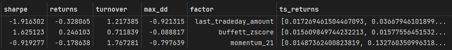
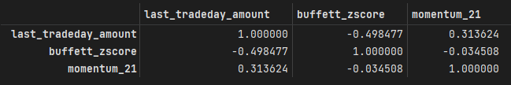
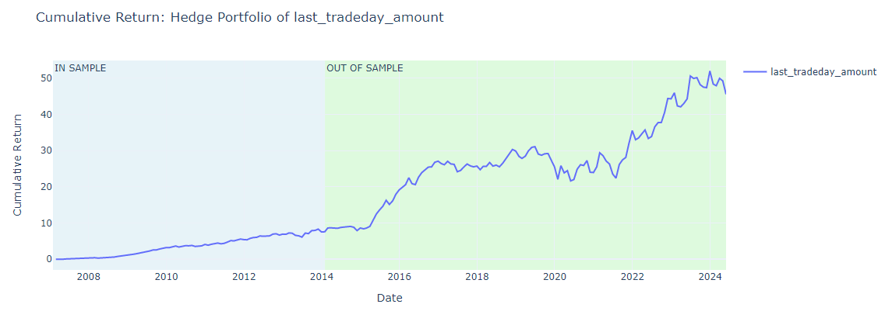
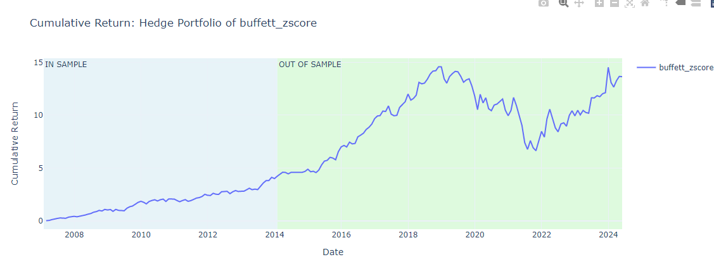
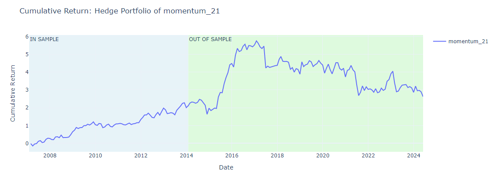

###  1. 因子与样本内表现

策略：
- universe为中证500
- 因子类型为fundamental & price volume
- 月频--每个月最后一个交易日调仓
- 股票多空策略

因子：最终都对因子值进行截面排序，用第一组与第十组构建多空策略
- last_tradeday_amount: 最后一个交易日的成交额
- buffett_zscore：巴菲特指标（Buffett Indicator，市场总市值与 GDP 之比）的标准化分数（z-score）
- momentum_21：过去21个交易日的动量因子

###  2. 样本外表现

首先我们根据is表现来判断该因子会持续有效。

为了使组合的收益为正，我们对is.sharpe为负的last_tradeday_amount和momentum_21做反方向交易，即下面的hedge_direction

#### 2.1 last_tradeday_amount
sharpe--returns--turnover--max_dd

0.8831605290401672 0.18625813972056435 1.036457966688697 -0.2947236261010202

#### 2.2 buffett_zscore
sharpe--returns--turnover--max_dd

0.6007194174636389 0.11943164058315031 0.5651585529205572 -0.5100253099077462

#### 2.3 momentum_21
sharpe--returns--turnover--max_dd

0.17499702992547306 0.036748604744499466 1.7139573699660593 -0.46383133553132494
